Prediction on Titanic Data
================
Pragna Bhatt
April 2021

Introduction
------------

The goal of this project is twofold: firstly to build a random forest
model to predict survival of passengers aboard the Titanic and secondly
to figure out what groups of people were most likely to survive. Some
grouping is already available in the dataset, such as gender, however
other groupings will need to be created from the available variables.

Data and Methods
----------------

The variables originally in the dataset were as follows:

Passenger ID: Unique identifying number for each passenger </br>
Survived: Whether the passenger survived or not (1 = Survived, 0 = Did
not survive) </br> Pclass: Passenger class (1st class, 2nd class, 3rd
class) </br> Name: Name of passenger </br> Sex: Sex of passenger
(female, male) </br> Age: Age of passenger </br> SibSp: Number of
siblings and spouses of passenger aboard </br> Parch: Number of parents
and children of passenger aboard </br> Ticket: Ticket number of
passenger </br> Fare: Amount of money passenger spent on ticket </br>
Cabin: Cabin category occupied by passenger </br> Embarked: What port
the passenger embarked from (C = Cherbourg, Q = Queenstown, S =
Southampton) </br>

The variable we are trying to predict here is ‘Survived’. The
categorical variables have been turned into factor variables from
‘character’ variables.

    ## 'data.frame':    891 obs. of  11 variables:
    ##  $ PassengerId: int  1 2 3 4 5 6 7 8 9 10 ...
    ##  $ Survived   : Factor w/ 2 levels "0","1": 1 2 2 2 1 1 1 1 2 2 ...
    ##  $ Pclass     : Factor w/ 3 levels "1","2","3": 3 1 3 1 3 3 1 3 3 2 ...
    ##  $ Name       : chr  "Braund, Mr. Owen Harris" "Cumings, Mrs. John Bradley (Florence Briggs Thayer)" "Heikkinen, Miss. Laina" "Futrelle, Mrs. Jacques Heath (Lily May Peel)" ...
    ##  $ Sex        : Factor w/ 2 levels "female","male": 2 1 1 1 2 2 2 2 1 1 ...
    ##  $ Age        : num  22 38 26 35 35 NA 54 2 27 14 ...
    ##  $ SibSp      : int  1 1 0 1 0 0 0 3 0 1 ...
    ##  $ Parch      : int  0 0 0 0 0 0 0 1 2 0 ...
    ##  $ Fare       : num  7.25 71.28 7.92 53.1 8.05 ...
    ##  $ Cabin      : chr  "" "C85" "" "C123" ...
    ##  $ Embarked   : Factor w/ 3 levels "C","Q","S": 3 1 3 3 3 2 3 3 3 1 ...

    ##   PassengerId    Survived Pclass      Name               Sex     
    ##  Min.   :  1.0   0:549    1:216   Length:891         female:314  
    ##  1st Qu.:223.5   1:342    2:184   Class :character   male  :577  
    ##  Median :446.0            3:491   Mode  :character               
    ##  Mean   :446.0                                                   
    ##  3rd Qu.:668.5                                                   
    ##  Max.   :891.0                                                   
    ##                                                                  
    ##       Age            SibSp           Parch             Fare       
    ##  Min.   : 0.42   Min.   :0.000   Min.   :0.0000   Min.   :  0.00  
    ##  1st Qu.:20.12   1st Qu.:0.000   1st Qu.:0.0000   1st Qu.:  7.91  
    ##  Median :28.00   Median :0.000   Median :0.0000   Median : 14.45  
    ##  Mean   :29.70   Mean   :0.523   Mean   :0.3816   Mean   : 32.20  
    ##  3rd Qu.:38.00   3rd Qu.:1.000   3rd Qu.:0.0000   3rd Qu.: 31.00  
    ##  Max.   :80.00   Max.   :8.000   Max.   :6.0000   Max.   :512.33  
    ##  NA's   :177                                                      
    ##     Cabin           Embarked
    ##  Length:891         C:168   
    ##  Class :character   Q: 77   
    ##  Mode  :character   S:646   
    ##                             
    ##                             
    ##                             
    ## 

From this summary, we see 342 people survived out of 891 total
passengers, that is about 38% of passengers survived.

#### Sex

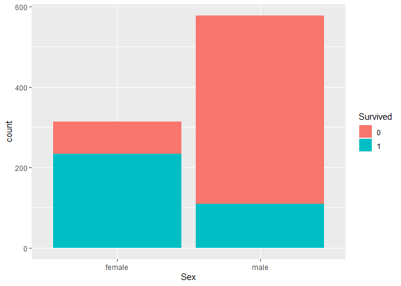<!-- -->

About 74% of the women aboard the Titanic survived and about 19% of the
men aboard the Titanic survived. The variable ‘sex’ seems to be quite
important in predicting as a much larger percentage of women survived
than men.

#### Parch and SibSp

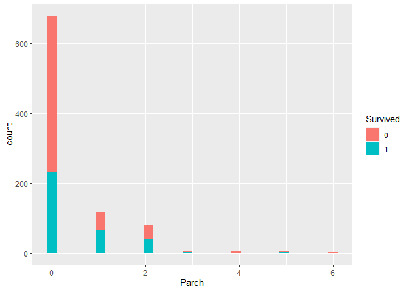<!-- -->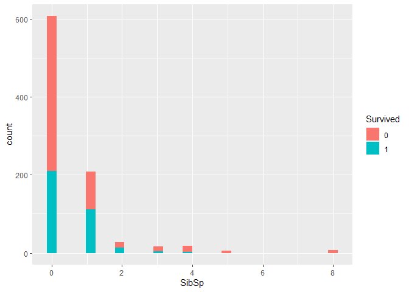<!-- -->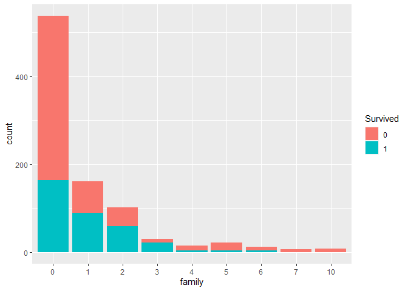<!-- -->
The ‘Parch’ and ‘SibSp’ variables were combined to create the ‘family’
variable representing how many total family members were onboard
(parents, siblings, spouses, children).

#### Passenger Class

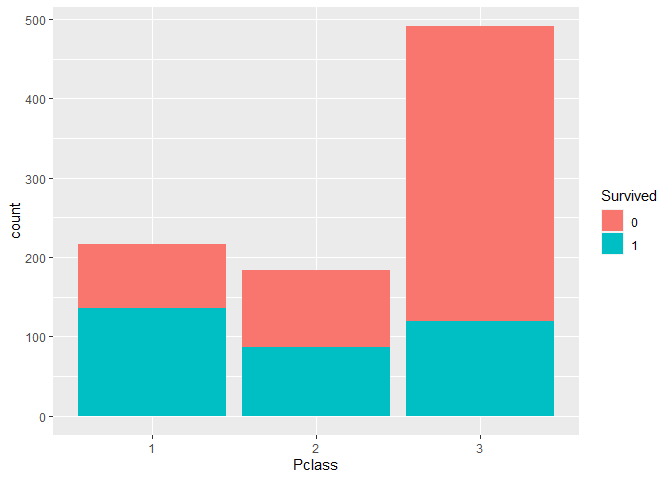<!-- -->

About 62% of Passenger Class 1, 47% of Passenger Class 2, and 24% of
Passenger Class 3 survived.

#### Cabin and Embarked

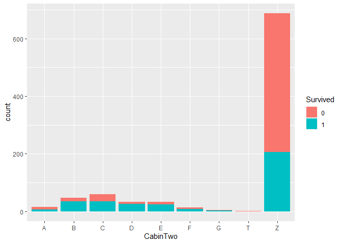<!-- -->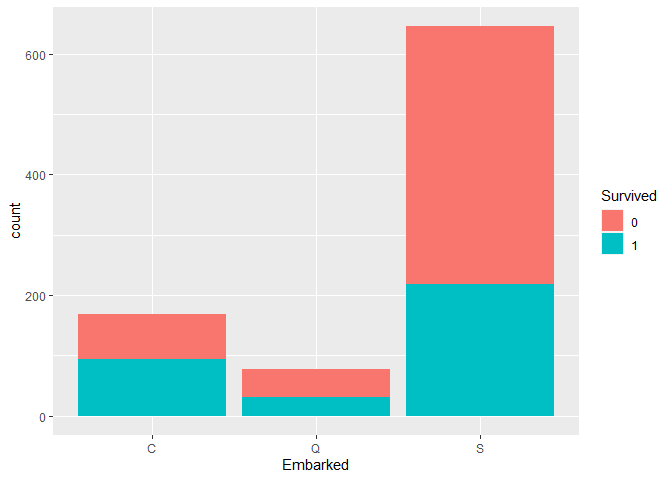<!-- -->

A lot of passengers had no data for the ‘Cabin’ variable, therefore the
category ‘Z’ was created for passengers with no cabin data. For other
passengers, the cabin number was removed and the variable ‘CabinTwo’ was
created using the cabin letter they were in.

For the variable ‘Embarked’, there were two missing values, therefore
mode imputation was used to fill in those values. 55% of those who
embarked from Cherbourg, 39% of those who embarked from Queenstown, and
34% of those who embarked from Southampton survived.

#### Name

From the ‘Name’ variable, titles were extracted and categorized into the
following subcategories: Master, Miss, Mr, Mrs, officer, other.

#### Age

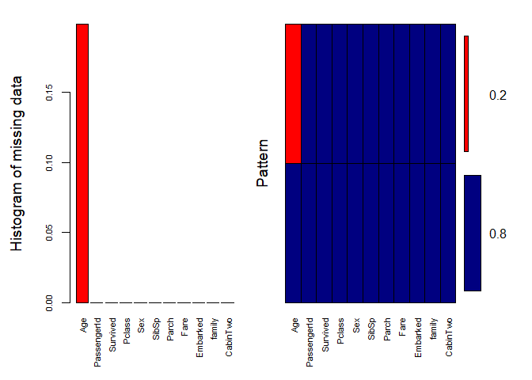<!-- -->

    ## 
    ##  Variables sorted by number of missings: 
    ##     Variable     Count
    ##          Age 0.1986532
    ##  PassengerId 0.0000000
    ##     Survived 0.0000000
    ##       Pclass 0.0000000
    ##          Sex 0.0000000
    ##        SibSp 0.0000000
    ##        Parch 0.0000000
    ##         Fare 0.0000000
    ##     Embarked 0.0000000
    ##       family 0.0000000
    ##     CabinTwo 0.0000000

Age had missing values therefore multiple imputation was needed to fill
in the missing values. However, before doing so, a holdout sample was
taken from the training data so that the random forest model could be
tested later using cross-validation. After taking the holdout sample,
multiple imputation was used on the remaining training data to create
five completed data sets. Similarly, multiple imputation was also used
on the holdout sample to create five completed holdout data sets. For
both, the default imputation methods available in the ‘mice’ package
were used. Additionally after multiple imputation, a new ‘AgeCategory’
variable was created which took the numeric variable age and created
categories from it. The cutoffs were: (0, 20\], (20,40\], (40, 60\],
(60, Inf).

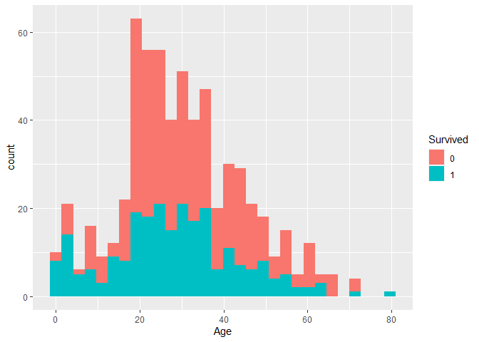<!-- -->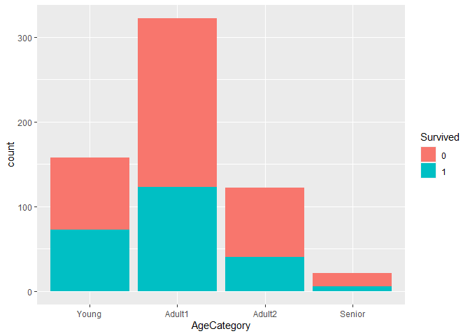<!-- -->

Here is a histogram both of the original ‘Age’ variable and a bar plot
of the new ‘AgeCategory’ variable.

Lastly multiple imputation was performed on the ‘test’ set resulting in
five completed ‘test’ sets. The training data was also put back together
with the holdout sample, and multiple imputation was performed on the
full training data. Next, a random forest model was fit on each of the
five imputed training sets and the resulting models were saved. Then,
these five models were used to predict the ‘Survived’ variable on each
of the five imputed test sets. This resulted in 25 sets of predictions
and for the final predictions, the mode of the predictions was chosen.

#### Results

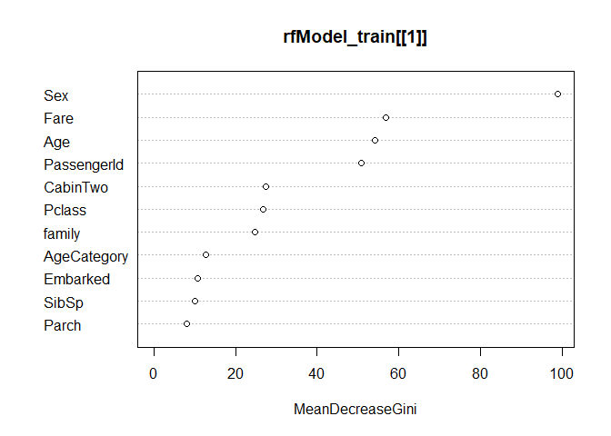<!-- -->

The variable importance plot for the model that performed the best is
given here. For the first model, all the variables were used. However,
when the variable importance plot was created, it ranked variables like
‘Name’ and ‘Ticket’ high which led to suspicion of overfitting. The
first model had a score of 74% on Kaggle, and by removing ‘Ticket’,
‘Name’, ‘Title’, and ‘Cabin’, the final model received a score of 77% on
Kaggle.

#### Conclusions/Future Work

The goal of this project was to predict survival on the Titanic and
determine which groups of people had a higher likelihood of surviving.
The first goal was met by building a random forest model that had a
prediction accuracy of 77% on the test set. As for the second goal, the
top five variables on the variable importance plot for the final model
were ‘Sex’, ‘Fare’, ‘Age’, ‘PassengerId’, and ‘CabinTwo’. We saw from
the visualizations that the percent of women who survived was far
greater than the percent of men who suvived. In future work, it may also
be helpful to explore ‘fare’ since it’s the second variable on this
importance plot. Perhaps higher fare increases probability of survival.
The variable ‘PassengerId’ is definitely the odd one out on the list,
but removing it reduced the prediction accuracy so it was kept for now.

‘AgeCategory’ and ‘Age’ were both up on the variable importance plot
implying age was also importance to survival. However before doing a
closer analysis of age, it is important to remember that ‘Age’ was the
variable that had a lot of missing values which were handled using
multiple imputation. In the future, something to consider may be using
only a subset of predictors in the predictor matrix when doing multiple
imputation since not all variables in the data are good predictors of
age. It is possible this may change the importance of age in the model.

Lastly, other prediction models are also worthy of consideration,
especially to understand which variables are most important. The biggest
problem with this analysis seemed to be overfitting. Therefore, to
understand what variables are truly important and worth using in the
random forest model, other prediction methods such as logistic
regression or other variable selection methods should be used.

#### Appendix

``` r
library(VIM)
library(mice)
library(randomForest)
library(scales)
library(ggplot2)

# Read in files

train <- read.csv("train.csv", header = TRUE)
test <- read.csv("test.csv", header = TRUE)

#Exploratory Data Analysis

dim(train)
head(train)
summary(train)
str(train)

sum(train$Cabin == "")
train$Survived <- as.factor(train$Survived)
train$Pclass <- as.factor(train$Pclass)
train$Sex <- as.factor(train$Sex)
train$Embarked[train$Embarked == ""] <- "S" # Mode Imputation 
train$Embarked <- as.factor(train$Embarked)
train$Ticket <- NULL


test$Pclass <- as.factor(test$Pclass)
test$Sex <- as.factor(test$Sex)
test$Embarked <- as.factor(test$Embarked) 
test$Ticket <- NULL

str(train)
summary(train)

 
p <- ggplot(train)
p + geom_bar(aes(x = Sex, fill = Survived))


 
train$family <- as.factor(train$Parch + train$SibSp)
test$family <- as.factor(test$Parch + test$SibSp)

p <- ggplot(train)
p + geom_histogram(aes(x = Parch, fill = Survived))
p + geom_histogram(aes(x = SibSp, fill = Survived))
p + geom_bar(aes(x = family, fill = Survived))

p + geom_bar(aes(x = Pclass, fill = Survived))


train$Cabin[train$Cabin == ""] <- "Z" # Denotes no cabin data
train$CabinTwo <- substr(train$Cabin, 1, 1)
train$CabinTwo <- as.factor(train$CabinTwo)
train$Cabin <- NULL

test$Cabin[test$Cabin == ""] <- "Z" # Denotes no cabin data
test$CabinTwo <- substr(test$Cabin, 1, 1)
test$CabinTwo <- as.factor(test$CabinTwo)
levels(test$CabinTwo) <- levels(train$CabinTwo)
test$Cabin <- NULL


p <- ggplot(train)
p + geom_bar(aes(x = CabinTwo, fill = Survived))
p + geom_bar(aes(x = Embarked, fill = Survived))


 

library(tidyverse)
train$Title <- str_extract(train$Name,",(.*?)\\.")
train$Title <- substring(train$Title, 3, nchar(train$Title)-1)
train$Title[train$Title == "Mme"] <- "Mrs"
train$Title[train$Title == "Mlle"] <- "Miss"
train$Title[train$Title == "Ms"] <- "Miss"
train$Title[train$Title %in% c("Capt", "Col", "Major", "Dr", "Rev")] <- "officer"
train$Title[train$Title %in% c("Jonkheer", "Lady", "Countess", "Sir", "Don", "Dona", "the Countess")] <- "other" 
train$Title <- as.factor(train$Title)
train$Name <- NULL 
train$Title <- NULL

test$Title <- str_extract(test$Name,",(.*?)\\.")
test$Title <- substring(test$Title, 3, nchar(test$Title)-1)
test$Title[test$Title == "Mme"] <- "Mrs"
test$Title[test$Title == "Mlle"] <- "Miss"
test$Title[test$Title == "Ms"] <- "Miss"
test$Title[test$Title %in% c("Capt", "Col", "Major", "Dr", "Rev")] <- "officer"
test$Title[test$Title %in% c("Jonkheer", "Lady", "Countess", "Sir", "Don", "Dona", "the Countess")] <- "other" 
test$Title <- as.factor(test$Title)
test$Name <- NULL
test$Title <- NULL

#summary(train$Title)
#p <- ggplot(train)
#p + geom_bar(aes(x = Title, fill = Survived))


 
aggr(train, col=c('navyblue','red'), numbers=TRUE, sortVars=TRUE, labels=names(train), cex.axis=.7, gap=3, ylab=c("Histogram of missing data","Pattern"))


 -----

smp_size <- floor(0.7 * nrow(train))
smp_size

set.seed(123456)
train_ind <- sample(seq_len(nrow(train)), size = smp_size)
train_cv <- train[train_ind,]
test_cv <- train[-train_ind,]

train_cv.impute <- mice(train_cv, m=5, maxit = 10)

train_cv_complete <- list()
for (i in 1:5){
  train_cv_complete[[i]] = complete(train_cv.impute, i)
  train_cv_complete[[i]]$AgeCategory <- cut(train_cv_complete[[i]]$Age, c(0, 20, 40, 60, Inf), labels = c("Young", "Adult1", "Adult2", "Senior"))
}

test_cv.impute <- mice(test_cv, m=5, maxit = 10)

test_cv_complete <- list()
for (i in 1:5){
  test_cv_complete[[i]] = complete(test_cv.impute, i)
  test_cv_complete[[i]]$AgeCategory <- cut(test_cv_complete[[i]]$Age, c(0, 20, 40, 60, Inf), labels = c("Young", "Adult1", "Adult2", "Senior"))
}


 
p <- ggplot(train_cv_complete[[1]])
p + geom_histogram(aes(x = Age, fill = Survived))
p + geom_bar(aes(x = AgeCategory, fill = Survived))


# Round 1: Cross Validation 

rfModel_train_cv <- list()
for (i in 1:5){
  rfModel_train_cv[[i]] <- randomForest(Survived ~., ntree = 2000, data = train_cv_complete[[i]])
}

n <- 1
predictions <- list()
for (i in 1:5){
  for (j in 1:5){
    prediction <- predict(rfModel_train_cv[[i]], newdata = test_cv_complete[[j]], response = "class")
    predictions[[n]] <- prediction
    n <- n+1
  }
}

predictionsCombine <- as.data.frame(do.call(cbind, predictions)) 
Mode <- function(x) {
  ux <- unique(x)
  ux[which.max(tabulate(match(x, ux)))]
}
predictionsCombine$final <- apply(predictionsCombine, 1, Mode)

sum(predictionsCombine$final == as.numeric(test_cv$Survived))/nrow(test_cv)

# Round 2: Now build random forest on whole training set and predict for test set.

train.impute <- mice(train, m=5, maxit = 10)

train_complete <- list()
for (i in 1:5){
  train_complete[[i]] = complete(train.impute, i)
  train_complete[[i]]$AgeCategory <- cut(train_complete[[i]]$Age, c(0, 20, 40, 60, Inf), labels = c("Young", "Adult1", "Adult2", "Senior"))
}

test.impute <- mice(test, m=5, maxit = 10)

test_complete <- list()
for (i in 1:5){
  test_complete[[i]] = complete(test.impute, i)
  test_complete[[i]]$AgeCategory <- cut(test_complete[[i]]$Age, c(0, 20, 40, 60, Inf), labels = c("Young", "Adult1", "Adult2", "Senior"))
}

rfModel_train <- list()
for (i in 1:5){
  rfModel_train[[i]] <- randomForest(Survived ~., ntree = 2000, data = train_complete[[i]])
}


n <- 1
predictions <- list()
for (i in 1:5){
  for (j in 1:5){
    prediction <- predict(rfModel_train[[i]], newdata = test_complete[[j]], response = "class")
    predictions[[n]] <- prediction
    n <- n+1
  }
}

predictionsCombine <- as.data.frame(do.call(cbind, predictions)) 
Mode <- function(x) {
  ux <- unique(x)
  ux[which.max(tabulate(match(x, ux)))]
}
predictionsCombine$final <- apply(predictionsCombine, 1, Mode)
test$Survived <- as.numeric(predictionsCombine$final)
test$Survived <- ifelse(test$Survived == 2, 1, 0)


write.csv(test[,c(1,ncol(test))], file = "predictionsTitanic.csv", row.names = FALSE)

varImpPlot(rfModel_train[[1]])
```
